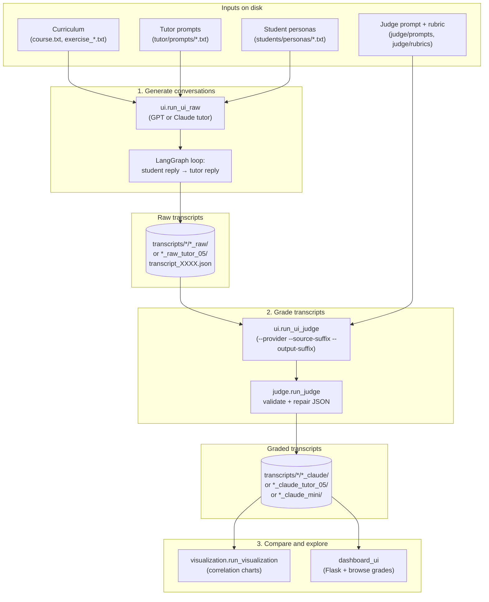

# Humanities LLM Tutor Project 2026

## Project Overview

### What I Built

I designed and built a **Socratic LLM tutor for MIT OpenCourseWare (OCW)** humanities and social sciences courses, intended as a deployable tool for students working through OCW assignments. The tutor is constrained to never give direct answers — it uses guided discovery, bite-sized responses, and formative feedback to walk students through assignments on topics like the trolley problem in philosophy or climate geography in urban studies.

To evaluate and improve the tutor before deployment, I built a complete validation framework alongside it: adversarial AI student bots that each probe a specific failure mode (demanding answers under pressure, going off-topic, lecturing a lost student), an LLM judge that grades conversations against a structured rubric, and a visualization module that compares GPT and Claude judge scores across all transcripts. The dashboard lets me browse every conversation and its grades side-by-side.

The primary deliverable is now **AskTIM** — an iframe-embeddable chat app live for the Spring 2026 *MIT 11.270x Cities and Climate Change* course. It wraps the same tutor pipeline in a Postgres-backed, identity-aware web app with token-streamed replies and cross-browser chat history. The student bots, judge, charts, and dashboard exist to stress-test the tutor systematically across different student personalities, courses, and difficulty levels before it reaches real learners.

### Why I Built It

- **Deployment goal:** Deliver a reliable Socratic tutor for OCW that guides students through humanities assignments without giving answers directly — working across the range of student types and engagement levels OCW sees in practice.
- **Validation goal:** Build a reproducible evaluation framework so tutor behaviour can be tested, graded, and compared across prompt versions before any version goes live.

## Technical Overview

### System Architecture

The system has five loosely coupled layers:

- **Conversation pipeline**: two LangGraph agents (tutor + student) trade messages in a structured multi-turn loop, each independently configurable via system prompt files
- **Judge pipeline**: a separate LangGraph agent reads a finished transcript and returns a structured JSON grade against a rubric, with up to 3 automatic repair-and-retry cycles
- **Dashboard + visualization**: a Flask web app for browsing transcripts side-by-side with Claude Mini (tutor_05) and Claude grades, and a matplotlib chart module for per-prompt score comparisons and hand-grade correlation analysis
- **Testing harness (`test_ui/`)**: a 3-step wizard for TAs to manually try out tutor prompt + course + exercise combinations against the same engine
- **Student-facing app (`main_ui/`)**: iframe-embeddable chat for real OCW students. Postgres persistence, bcrypt-hashed email+password identity, Server-Sent Events streaming, cross-browser conversation history. See [`main_ui/README.md`](main_ui/README.md).

### Key Components

**Tutor Agent (`tutor/run_tutor.py`):** A LangGraph graph with a single node that calls GPT and returns a two-field JSON response — internal pedagogical reasoning (hidden from students) and a student-facing answer. The system prompt is loaded from a versioned `.txt` file and can be overridden with an assignment block at runtime.

**Student Bot (`students/run_student.py`):** Shares the same LangGraph infrastructure as the tutor, but uses a persona prompt from `students/personas/` to simulate a specific type of student. Includes a heuristic guard and automatic retry if the bot starts sounding like a tutor.

**Judge (`judge/run_judge.py`):** Reads a transcript, constructs a grading prompt by injecting the rubric and output schema, and calls the selected provider (`gpt` or `claude`). Validates the JSON response against the rubric spec, auto-repairs on failure up to 3 attempts, and writes the grade back into the transcript file. The current rubric (`rubric_05`, 46 pts) scores three sections: Pedagogy (24 pts — Socratic method, scaffolding, meta-learning), Dialogue Quality (12 pts — redundancy, assignment anchoring), and Communication Quality (10 pts — bite-sized responses, tone).

**UI Runners (`ui/`):** Parallelized runners using `ThreadPoolExecutor` (default 6 workers) — raw transcript generation (`run_ui_raw`), mini-continuation generation (`run_ui_raw_mini`), transcript judging (`run_ui_judge`). Runners accept `--provider`, `--prompt`, `--rubric`, `--source-suffix`, `--output-suffix`, and `--yes` CLI flags as applicable.

**Dashboard (`dashboard_ui/`):** Flask app that discovers all raw transcripts on disk, loads Claude Mini (tutor_05) and Claude grades for each, and serves a sortable comparison table and per-transcript detail view via a single-page JS frontend.

**Student app (`main_ui/`):** Production-shape Flask app for the live OCW deployment. Streams tutor replies token-by-token via SSE while keeping the `pedagogical-reasoning` field hidden server-side. Persists conversations and messages to Postgres (Alembic-managed schema). Soft identity via a two-stage email + password modal that fires after the third student message — passwords are bcrypt-hashed in a separate `students` table, and the email cookie carries forward across browsers for chat-history continuity.

## Code in Action: Conversation Flow Example

### 1. Tutor Prompt (`tutor/prompts/tutor_05.txt`)

- Instructs the tutor to never state the answer directly
- Requires guided questions that move the student toward insights themselves
- Limits responses to one or two focused questions or observations per turn

### 2. Student Persona (`students/personas/chaotic_01.txt`)

- Simulates a student who pushes back against Socratic questioning
- Demands direct answers and complains the method is unhelpful
- Tests whether the tutor holds its role under social pressure

### 3. Resulting Conversation (`transcripts/chaotic/chaotic_raw/transcript_0001.json`)

- Student opens by demanding the answer directly, refusing to engage
- Tutor deflects with a targeted question about the student's existing understanding
- Student reluctantly engages, making small correct steps each turn
- Tutor acknowledges progress and raises the next sub-question without giving away the conclusion

### 4. Judge Output (grade written back into the transcript JSON)

- Three sections scored: Pedagogy, Dialogue Quality, Communication Quality
- Per-criterion deductions include a sub-criterion ID, turn evidence, reason, and point value
- Total score, max score, overview paragraph, and full judge reasoning all recorded alongside the grade

## How the Workflow Runs

End-to-end flow from assignment content through simulation, judging, and analysis:



**1. Load prompts and build agents**

```python
system_prompt = load_system_prompt("tutor_05", assignment_override=assignment_text)
tutor_graph = create_tutor_graph(system_prompt)
student_graph = build_graph(prompt_name="chaotic_01")
```

**2. Run the multi-turn conversation loop**

```python
for turn_index in range(config.turn_size):
    student_msg = get_next_student_message(student_messages, graph=student_graph)
    tutor_messages, tutor_text = get_tutor_reply(tutor_messages, graph=tutor_graph)
```

**3. Save the raw transcript to disk**

```python
payload = {
    "tutor_prompt": "tutor_03", "student_persona": "chaotic_01",
    "course": "philosophy", "exercise_number": "01",
    "exchanges": transcript_exchanges,
}
transcript_path.write_text(json.dumps(payload, indent=2))
```

**4. Grade the transcript with the judge**

```python
result = judge_transcript(
    "chaotic/chaotic_gpt/transcript_0001",
    provider="gpt",
    prompt_name="judge_05",
    rubric_name="rubric_05",
)
print(result.total_score, result.max_score)  # e.g. 38, 46
```

**5. Generate score comparison charts**

```powershell
python -m visualization.run_visualization
# Output: visualization/outputs/claude_grades_all_transcripts.png (+ more)
```

## Project Structure & File Guide

### Directory Overview

```text
humanities_llm_tutor_project_2026/
│
├── curriculum/
│   ├── philosophy/          # course.txt + exercise_01.txt (trolley problem)
│   └── cities_and_climate_change/  # course.txt + exercise_01..12.txt
│
├── students/
│   ├── run_student.py       # Shared LangGraph engine for all personas
│   └── personas/            # chaotic_01..06, cooperative_01..06, clueless_01..06
│
├── tutor/
│   ├── run_tutor.py         # LangGraph engine + prompt loading + response parsing
│   ├── run_tutor_mini.py    # Fork a raw transcript at a pivot turn with a new tutor
│   └── prompts/             # tutor_01.txt .. tutor_05.txt (versioned system prompts)
│
├── judge/
│   ├── run_judge.py         # Unified single-transcript judge (provider gpt/claude)
│   ├── prompts/             # judge_01.txt .. judge_08.txt
│   └── rubrics/             # rubric_01.md .. rubric_08.md (current default: rubric_05)
│
├── ui/
│   ├── run_ui_raw.py        # Generate raw transcripts in bulk (--output-suffix, --yes)
│   ├── run_ui_raw_mini.py   # Interactive wrapper for mini-continuation runs
│   └── run_ui_judge.py      # Grade transcripts (--provider, --source-suffix, --output-suffix, --yes)
│
├── transcripts/
│   ├── chaotic/             # chaotic_raw/, chaotic_claude/, chaotic_mini/,
│   │                        # chaotic_claude_mini/, chaotic_raw_tutor_05/, chaotic_claude_tutor_05/
│   ├── cooperative/         # cooperative_raw/, cooperative_claude/,
│   │                        # cooperative_raw_tutor_05/, cooperative_claude_tutor_05/
│   └── clueless/            # clueless_raw/, clueless_claude/, clueless_mini/,
│                            # clueless_claude_mini/, clueless_raw_tutor_05/, clueless_claude_tutor_05/
│
├── dashboard_ui/
│   ├── run_dashboard_ui.py  # Flask app: routes, data loading, grade summaries
│   └── static/app.js        # Frontend: routing, sortable table, Chart.js histograms
│
├── test_ui/
│   ├── run_app.py           # Flask app: wizard config + chat API routes
│   └── templates/index.html # 3-step wizard (tutor → course → exercise) + human chat
│
├── main_ui/                 # Student-facing AskTIM app (iframe-embed, Postgres, SSE)
│   ├── run_app.py           # Flask factory; SSE /api/chat; identity routes
│   ├── db/                  # SQLAlchemy models + Alembic migrations
│   ├── routes/              # embed, chat (SSE), identity, history
│   ├── services/            # conversation persistence, students (bcrypt), tutor_bridge
│   ├── static/              # chat.css, chat.js (streaming consumer)
│   └── templates/embed.html # iframe-embeddable chat page
│
├── visualization/
│   └── run_visualization.py # Score charts: per-prompt, original vs mini, hand-grade correlation
│
└── utils/
    └── parsing.py           # Shared JSON extraction helper
```

## Current Status

The full pipeline is working end-to-end, with:

- 3 persona families × 6 variants each (chaotic, cooperative, clueless) — 18 student personas total
- 2 courses: `philosophy` (1 exercise) and `cities_and_climate_change` (12 exercises)
- Raw transcripts across multiple prompt versions: standard `*_raw/` (tutor_04) and `*_raw_tutor_05/` (tutor_05), 10 transcripts per persona per version
- Mini-continuation transcripts in `*_mini/` for selected chaotic and clueless transcripts (tutor_05, Claude), with corresponding Claude grades in `*_claude_mini/`
- Judge prompts versioned up to `judge_08`, rubrics up to `rubric_08` (current default: `rubric_05`, 46 pts)
- Dashboard shows Claude Mini (tutor_05) grades vs Claude (tutor_04) grades side-by-side
- Visualization outputs per-persona score charts for standard and tutor_05 runs, original vs mini grouped bar comparisons, and hand-grade Pearson/Spearman correlation charts
- **AskTIM (`main_ui/`)** is feature-complete through Step 9 (token streaming) — Postgres persistence, email + password identity, cross-browser history, SSE-streamed replies. Steps 10–12 (image uploads, multi-iframe test host, formal test suite) remain.

## Challenges and How I Solved Them

- **Keeping the tutor in Socratic mode:** Getting GPT to never reveal answers required extensive prompt engineering. Added pedagogical reasoning as a separate JSON field so the model "thinks out loud" before answering, which consistently improves restraint.
- **Adversarial student bots that sound like tutors:** The student LangGraph node includes a heuristic that detects tutor-like phrasing (numbered agendas, coaching frameworks) and auto-retries with a correction message before returning the response.
- **LLM judge output validation:** Judge responses sometimes came back with float scores, missing fields, or malformed JSON. Built a multi-strategy extraction pipeline (raw JSON → fenced code block → brace extraction → `ast.literal_eval`) with up to 3 repair-and-retry cycles.
- **GPT vs Claude grade alignment:** Initial rubric versions produced high inter-judge variance. Migrating to `rubric_05` (simplified scoring, no malus deductions, mandatory sub-criterion IDs on deductions) measurably improved GPT/Claude correlation.
- **Inconsistent judge output schemas:** Different model versions and prompt iterations produced criteria in three different JSON shapes (flat keys, nested `criteria` dict, score under `base`). Built a normalization layer applied at write time and retroactively migrated all 927 graded transcripts with criterion data to a single canonical format.

## Future Possibilities

- Additional student persona families and course subjects
- Human-in-the-loop evaluation to calibrate the LLM judge against human graders
- ML-assisted rubric refinement based on judge disagreement patterns
- Image uploads in AskTIM (students attaching figures to questions; tutor receiving exercise figures as context — Phase 6 + main_ui Step 10)
- Railway-hosted production deployment of AskTIM with end-of-course migration to internal storage

## TL;DR

A Socratic LLM tutor built for MIT OpenCourseWare that guides students through humanities assignments using guided discovery and never gives answers directly — validated against simulated adversarial conversations, graded automatically by GPT & Claude judges across a structured rubric, analyzed to measure judge consistency, and shipped as an iframe-embeddable student app (AskTIM) for the Spring 2026 *Cities and Climate Change* course with token streaming and identity-aware chat history.

---

**Project Duration:** Spring 2026  
**Technologies:** Python, LangGraph, LangChain, OpenAI API, Anthropic API, Flask, SQLAlchemy + Alembic, PostgreSQL, bcrypt, Server-Sent Events, Chart.js, matplotlib, Git
